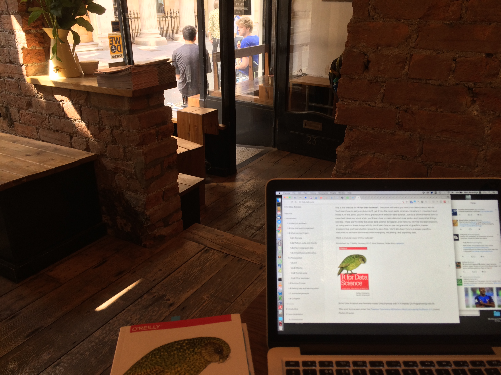
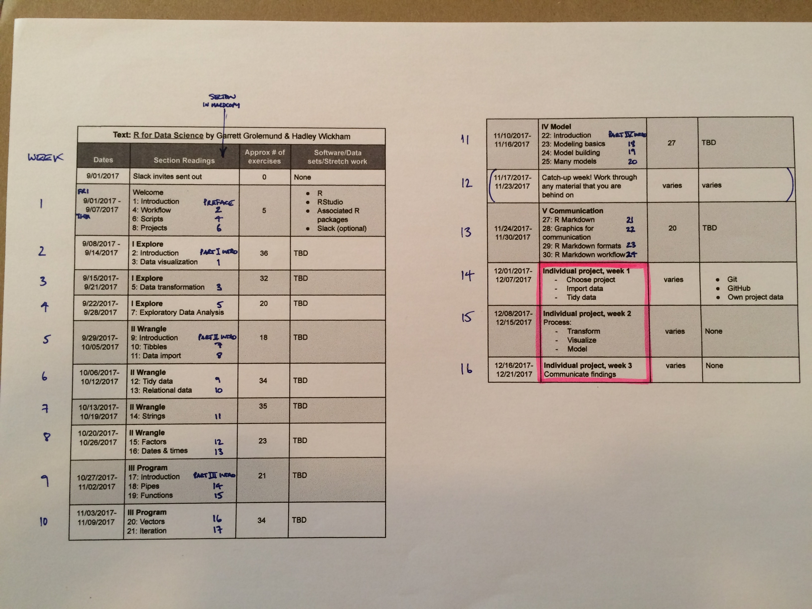

# MOOC : "R for Data Science"
###### 1/9/17 - 21/12/17

"The goal of this online community is to provide a friendly and supportive online space for you to work with likeminded people just getting started in data analysis by reading “[**R for Data Science**](http://r4ds.had.co.nz/)”, a free and publicly available book written by Garrett Grolemund and Hadley Wickham" -- Jesse Maegan [20/8/17 blog post](https://medium.com/@kierisi/join-the-r-for-data-science-online-learning-community-842527222ab3)

Files in this repo contain my answers from attempting Exercises in the book, (grouped into Weeks, as in the Curriculum). I've tried to give credit if I copied someone else (and I probably don't know/ understand those answers yet), or quoted from discussions I had in R4ds Slack. (If I forgot to, it was probably [jrnold](https://jrnold.github.io/r4ds-exercise-solutions/), and thanks/apologies to him)

_This MOOC refers to online chapter numbers. The printed book has different chapter numbers. (See image of Curriculum, below)_

## Curriculum

_Original curriculum (before Wk09 was made an extra 'catch-up') :_

#### Wk01
* Chapters : [1](http://r4ds.had.co.nz/introduction.html) , [4](http://r4ds.had.co.nz/workflow-basics.html) , [6](http://r4ds.had.co.nz/workflow-scripts.html) , [8](http://r4ds.had.co.nz/workflow-projects.html)
* _JesseMaegan blog : [2/9/17](https://medium.com/@kierisi/r4ds-onboarding-reflections-22b71878821f) , [5/9/17](https://medium.com/@kierisi/r4ds-learning-to-learn-b22ffa7419f8) , [6/9/17](https://medium.com/@kierisi/r4ds-week-1-dont-panic-e9e290062806) , [7/9/17](https://medium.com/@kierisi/r4ds-week-1-reflection-fbdbc336adc)_

---

#### Wk02 : [Explore] : Data visualization
* Chapters : [2](http://r4ds.had.co.nz/explore-intro.html) , [3](http://r4ds.had.co.nz/data-visualisation.html)
* New package : **ggplot2**
* _JesseMaegan blog : [9/9/17](https://medium.com/@kierisi/r4ds-week-2-data-visualization-vocabulary-fc8fa4d20d2d) , [13/9/17](https://medium.com/@kierisi/r4ds-week-2-its-not-too-late-1f1ca71cfc79)_

---

#### Wk03 : [Explore] : Data transformation
* Chapter : [5](http://r4ds.had.co.nz/transform.html)
* New packages : **dplyr** , (RcppRoll)
* _JesseMaegan blog : [20/9/17](https://medium.com/@kierisi/r4ds-week-3-just-breathe-c07813617b61) "Just Breathe"_

---

#### Wk04 : [Explore] : Exploratory Data Analysis (EDA)
* Chapter : [7](http://r4ds.had.co.nz/exploratory-data-analysis.html)
* New packages : (modelr) , (ggstance , lvplot , ggbeeswarm) , (seriation , d3heatmap , heatmaply) , (hexbin)
* _JesseMaegan blog : [27/9/17](https://medium.com/@kierisi/r4ds-week-4-an-eda-state-of-mind-cf9679499ee4) "An EDA state of mind"_

---

#### Wk05 : [Wrangle] : Tibbles; Data import
* Chapters : [9](http://r4ds.had.co.nz/wrangle-intro.html) , [10](http://r4ds.had.co.nz/tibbles.html) , [11](http://r4ds.had.co.nz/data-import.html)
* New packages : **tibble** , **readr** , (webreadr) , (hms) , (feather) , (haven , readxl , DBI , jsonlite , xml2 , rio)
* _JesseMaegan blog : [4/10/17](https://medium.com/@kierisi/r4ds-week-5-its-ok-to-feel-lost-sometimes-5dc8f20ddd6c) "it’s OK to feel lost sometimes"_

---

#### Wk06 : [Wrangle] : Tidy data; Relational data
* Chapter : [12](http://r4ds.had.co.nz/tidy-data.html) , [13](http://r4ds.had.co.nz/relational-data.html)
* New packages : **tidyr** , (Lahman)
* _JesseMaegan blog : [11/10/17](https://medium.com/@kierisi/r4ds-week-6-tidying-up-your-data-d5180ecff860) "Tidying up your data"_

---

#### Wk07 : [Wrangle] : Strings
* Chapter : [14](http://r4ds.had.co.nz/strings.html)
* New packages : **stringr** , (stringi)
* _JesseMaegan blog : [19/10/17](https://medium.com/@kierisi/r4ds-week-7-star-wars-and-string-manipulation-9ab77ebe8a66) "Star Wars, regex, and string manipulation"_

---

#### Wk08 : [Wrangle] : Factors; Dates & times
* Chapter : [15](http://r4ds.had.co.nz/factors.html) , [16](http://r4ds.had.co.nz/dates-and-times.html)
* New packages : **forcats** , **lubridate**
* _JesseMaegan blog : [26/10/17](https://medium.com/@kierisi/r4ds-week-8-factors-forcats-4b7f27cffd60) "factors & forcats"_

---

#### _Wk09 : (Catch-up week added)_

---

#### Wk10 : [Program] : Pipes; Functions
* Chapter : [17](http://r4ds.had.co.nz/program-intro.html) , [18](http://r4ds.had.co.nz/pipes.html) , [19](http://r4ds.had.co.nz/functions.html)
* New packages : **magrittr**
* _JesseMaegan blog : [8/11/17](https://medium.com/@kierisi/r4ds-week-10-what-the-h-ck-is-a-function-a2eeba19b8f0) "What the h*ck is a function?"_

---

#### Wk11 : [Program] : Vectors; Iteration
* Chapter : [20](http://r4ds.had.co.nz/vectors.html) , [21](http://r4ds.had.co.nz/iteration.html)
* New packages : **purrr**

---

#### _Wk12 : (Catch-up week)_

---

#### Wk13 : [Model]
* Chapter : [22](http://r4ds.had.co.nz/model-intro.html) , [23](http://r4ds.had.co.nz/model-basics.html) , [24](http://r4ds.had.co.nz/model-building.html) , [25](http://r4ds.had.co.nz/many-models.html)
* New packages : **modelr** [re. Wk04] , (splines) , (MASS) , **broom** , (gapminder)

---

#### Wk14 : [Communication] : RMarkdown, graphics
* Chapter : ([26](http://r4ds.had.co.nz/communicate-intro.html)) , [27](http://r4ds.had.co.nz/r-markdown.html) , [28](http://r4ds.had.co.nz/graphics-for-communication.html) , [29](http://r4ds.had.co.nz/r-markdown-formats.html) , [30](http://r4ds.had.co.nz/r-markdown-workflow.html)
* New packages : **rmarkdown** , **knitr** , (xtable , stargazer , pander , tables , ascii) , (ggrepel , viridis) , (RColorBrewer) , (ggthemes) , (revealjs , rmdshower/shower) , **flexdashboard** , (dygraphs , DT , rthreejs , DiagrammeR) , **Shiny** , (bookdown , prettydoc , rticles) , (packrat , checkpoint)

---

#### _Wk15 : (Individual project)_

---

#### _Wk16 : (Individual project)_
* _JesseMaegan blog : [22/12/17](https://medium.com/@kierisi/r4ds-the-next-iteration-d51e0a1b0b82) "R4DS: the next iteration"_

## Other Links
* [rfordatascience.slack.com](https://rfordatascience.slack.com/)
* [github.com/rfordatascience](https://github.com/rfordatascience) ...re. the MOOC/ community
* [github.com/hadley/r4ds](https://github.com/hadley/r4ds) ...re. the book